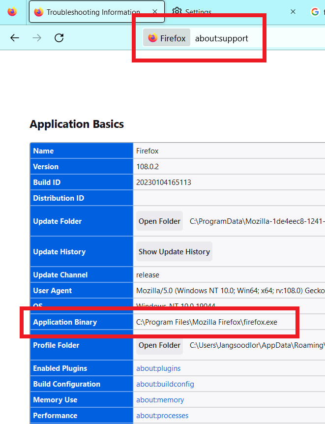
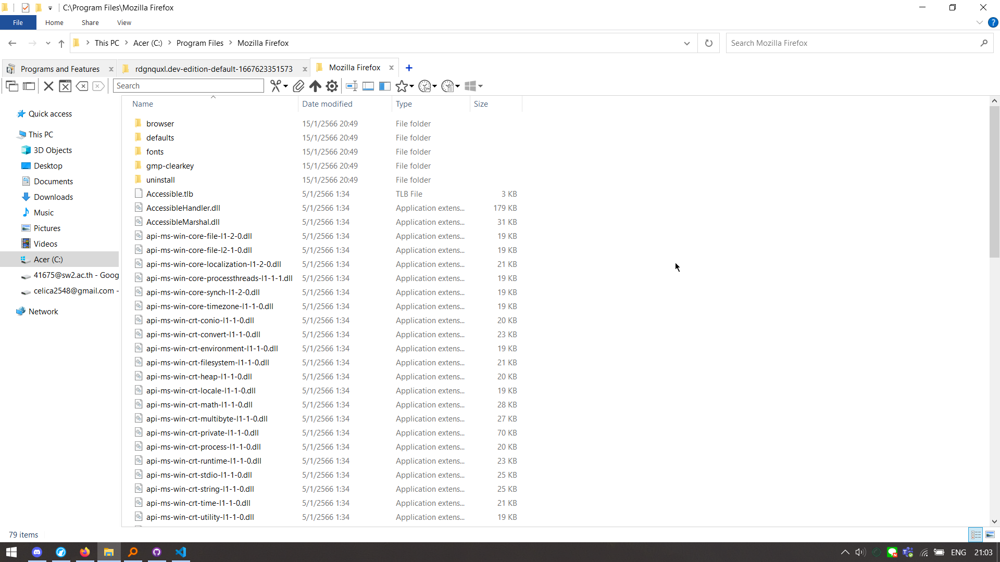
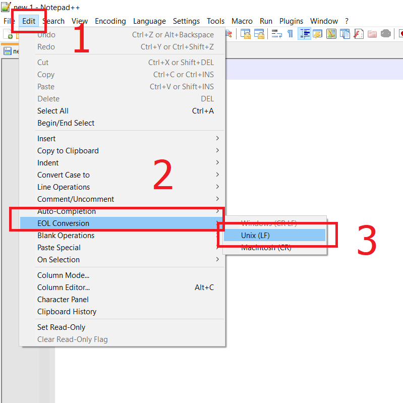

# IMPORTANT
I've tested this method **only on Windows.** It works on both Firefox and LibreWolf. For other OSes, please refer to [This Page](https://support.mozilla.org/en-US/kb/customizing-firefox-using-autoconfig).

### Sources
[This reddit thread's top comment](https://old.reddit.com/r/FirefoxCSS/comments/gowbcb/how_to_set_a_custom_startpage_as_new_tab_page/). Which leads to [Another thread](https://old.reddit.com/r/firefox/comments/ge86z4/newtab_page_to_local_file_firefox_76_redux/) and [Firefox Support page](https://support.mozilla.org/en-US/kb/customizing-firefox-using-autoconfig)

Without further ado, let's begin.

## 1. Find your Firefox installation directory

Go to [about:support](about:support) . In the "Application Binary" section (highlighted below) is where your Firefox directory is.

Then, open it. I will refer to this directory as "main directory" from now on.

You need to create 2 files. Namely `autoconfig.js` in `defaults/pref` folder and `firefox.cfg` in the main directory.

## 2. Create autoconfig.js file

Go to `defaults/pref` folder and create a file named `autoconfig.js` there.

This file needs to use Unix end-of-line (LF), even on Windows systems. Here's how to do it in Windows using [Notepad++](https://notepad-plus-plus.org/)

Then copy and paste the code below

<pre>pref("general.config.filename", "firefox.cfg");
pref("general.config.obscure_value", 0);</pre>

Note: You can use use different name to your .cfg file

## 3. Create firefox.cfg file
Go back to the main directory. then create the firefox.cfg file

After that, Copy and paste the code below.

<pre>
//
var {classes:Cc,interfaces:Ci,utils:Cu} = Components;

/* set new tab page */
try {
  Cu.import("resource:///modules/AboutNewTab.jsm");
  var newTabURL = "file:///X:/folder/yourfile.html";
  AboutNewTab.newTabURL = newTabURL;
} catch(e){Cu.reportError(e);} // report errors in the Browser Console
</pre>

Please note that you must use **FORWARD SLASH** for your html file's directory.

the new tab page will change after restarting firefox

## BUT WAIT I STILL SEE THE SAME START PAGE AFTER I RESTART FIREFOX HOW
Try open a new tab page. If it's the page you set in the config file, then CONGRATS. You have sucessfully changed your startpage. All you need to do is to **[CHANGE YOUR HOMEPAGE](https://support.mozilla.org/en-US/kb/how-to-set-the-home-page)**. If not, there's something wrong in the procedure.

